## GIT版本控制器的含义

CVS和Subversion属于传统的版本控制系统，而分布式版本控制系统最大的特点是不需要每次提交都把文件推送到版本控制服务器，而是采用分布式版本库的机制，使得每个开发人员都够从服务器中克隆一份完整的版本库到自己计算机本地，不必再完全依赖于版本控制服务器，使得源代码的发布和合并更加方便，并且因为数据都在自己本地，不仅效率提高了，而且即便我们离开了网络依然可以执行提交文件、查看历史版本记录、创建分支等等操作，真的是开发者的福音啊
Git不仅是一款开源的分布式版本控制系统，而且有其独特的功能特性，例如大多数的分布式版本控制系统只会记录每次文件的变化，说白了就是只会关心文件的内容变化差异，而Git则是关注于文件数据整体的变化，直接会将文件提交时的数据保存成快照，而非仅记录差异内容，并且使用SHA-1加密算法保证数据的完整性。

    Git为了提高效率，对于没有被修改的文件，则不会重复存储，而是创建一个链接指向之前存储过的文件

### 安装git

#### 源码安装

下载依赖

    $ yum install curl-devel expat-devel gettext-devel \
      openssl-devel zlib-devel

Git官网站点

    http://git-scm.com/download

编译与安装

    $ tar -zxf git-1.7.2.2.tar.gz`
    $ cd git-1.7.2.2
    $ make prefix=/usr/local all
    $ sudo make prefix=/usr/local install

#### 方法二

    yum install git-core

现在已经可以用 git 命令了，用 git 把 Git 项目仓库克隆到本地，以便日后随时更新：

\$ git clone git://git.kernel.org/pub/scm/git/git.git

### 使用Git仓库

在正式使用前，我们还需要弄清楚Git的三种重要模式，分别是已提交、已修改和已暂存：

    已提交（committed）:表示数据文件已经顺利提交到Git仓库里了
    已修改（modified）:表示数据文件已经被修改了，但未被保存到Git数据库
    已暂存（staged）：表示数据文件已经

提交前的数据文件可能会被随意修改或丢弃，但只要把文件快照顺利提交到Git数据仓库，那就可以完全放心了，流程如下：

1.  在工作目录中修改数据文件
2.  将文件的快照放入暂存区域
3.  将暂存区域的文件快照提交到Git仓库
    流程图如下：

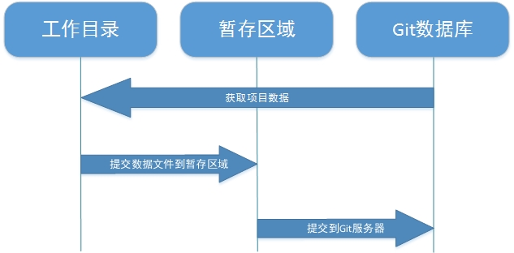

##### 安装Git服务程序

    [root@serverA ~]# yum -y install git

首次安装Git服务程序后需要设置下用户名称、邮件信息和编辑器，这些信息会随着文件每次都提交到Git数据库中，用于记录提交者的信息，而Git服务程序的配置文档通常会有三份，针对当前用户和指定仓库的配置文件优先级最高：

| 配置文件                              | 作用                  |
| --------------------------------- | ------------------- |
| /etc/gitconfig                    | 保存着系统中每个用户及仓库通用配置信息 |
| ~/.gitconfig或~/.config/git/config | 针对当前用户的配置信息         |
| 工作目录./git/config                  | 针对于当前仓库数据的配置信息      |

第一个要配置的是你个人的用户名称和电子邮件地址，这两条配置很重要，每次 Git 提交时都会引用这两条信息，记录是谁提交了文件，并且会随更新内容一起被永久纳入历史记录：
第一个要配置的是你个人的用户名称和电子邮件地址，这两条配置很重要，每次Git提交时都会引用这两条信息，记录是谁提交了文件，并会随着更新内容而永久纳入历史记录。
注意：git命令必须要在Git仓库目录下
#### 配置个人信息
第一个要配置的是你个人的用户名称和电子邮件地址。这两条配置很重要，每次 Git 提交时都会引用这两条信息，说明是谁提交了更新，所以会随更新内容一起被永久纳入历史记录：

    #配置个人用户名称
    [root@serverA software]# git config --global user.name "Liu Shan Xin"
    #配置个人邮箱
    [root@serverA software]# git config --global user.email "L1797261354@163.com"
    #配置个人编辑器
    [root@serverA software]# git config --global core.editor vim
    #查看个人config的配置
    [root@serverA software]# git config --list
    user.name=Liu Shan Xin
    user.email=L1797261354@163.com
    core.editor=vim
如果用了 —global 选项，那么更改的配置文件就是位于你用户主目录下的那个，以后你所有的项目都会默认使用这里配置的用户信息。如果要在某个特定的项目中使用其他名字或者电邮，只要去掉 —global 选项重新配置即可，新的设定保存在当前项目的 .git/config 文件里。

#### 查看个人信息
要检查已有的配置信息，可以使用 git config —list 命令：
```
[root@serverA ServerA]# git config --list
user.name=Liu Shan Xin
user.email=L1797261354@163.com
core.editor=vim
core.repositoryformatversion=0
core.filemode=true
```
直接查询某个变量设定，只需要把特定的名字跟在后面即可，像这样：
```
[root@serverA ServerA]# git config user.email
L1797261354@163.com
```
### 获取git帮助
常用方法：
```
$ git help <verb>
$ git <verb> --help
$ man git-<verb>
```
举例
```
[root@serverA ServerA]# git help config
```
### 仓库管理
- Git仓库的基本操作
    -初始化一个Git残酷
    - 将文件添加到Git的暂存区
    - 查看项目当前文件的提交状态（A：提交成功；AM文件在添加到缓存之后又有改动）- 从Git的暂存区提交版本到仓库，参数-m后为备注信息。
    - 将本地的Git仓库信息推送上传到远程服务器
    - 查看git提交的日志信息
    - 修改仓库名称
    - 添加新的仓库
    - 查看当前仓库对应的远程仓库地址
    - 修改仓库对应的远程仓库地址
#### 创建本地目录与版本库

我们可以简单的把工作目录理解成是一个被Git服务程序管理的目录，Git会时刻的追踪目录内文件的改动，另外在安装好了Git服务程序后，默认就会创建好了一个叫做master的分支，我们直接可以提交数据到主线了。

创建本地的工作目录

    [root@serverA ~]# mkdir /usr/local/ServerA
    [root@serverA ~]# cd /usr/local/ServerA/

将该目录初始化转化成Git的工作目录
```
    #这是将git仓库初始化为普通仓库
    [root@serverA ServerA]# git init
    hint: Using 'master' as the name for the initial branch. This default branch name
    hint: 	git branch -m <name>
    Initialized empty Git repository in /usr/local/ServerA/.git/（出现这个，代表正确）
    裸仓库 (git init --bare)
    git init --bare
```
裸仓库与普通仓库的区别是什么

| 特性 | 普通仓库 (git init) | 裸仓库 (git init --bare) | Col4 |
| --- | --- | --- | --- |
| 工作目录 | 有 | 无 |  |
| 直接编辑文件 | 可以 | 不可以 |  |
| 用途 | 本地开发 | 远程中心仓库 |  |
| 结构 | .git子目录 + 工作文件 | 只有 .git的内容 |  |
| 命名习惯 | 项目名 (如 myproject) | 项目名 + .git(如 myproject.git) |  |
| 推送权限| 	通常无法推送（有工作树） | 可以接受推送 |  |


#### 从远程仓库克隆

如果想对某个开源项目出一份力，可以先把该项目的 Git 仓库复制一份出来，这就需要用到 git clone 命令。Git 收取的是项目历史的所有数据（每一个文件的每一个版本），服务器上有的数据克隆之后本地也都有了。实际上，即便服务器的磁盘发生故障，用任何一个克隆出来的客户端都可以重建服务器上的仓库，回到当初克隆时的状态（虽然可能会丢失某些服务器端的挂钩设置，但所有版本的数据仍旧还在，有关细节请参考第四章）。
克隆仓库的命令格式为:

    git clone [url]
    范例:
    git clone git://github.com/schacon/grit.git

这会在当前目录下创建一个名为grit的目录，其中包含一个 .git 的目录，用于保存下载下来的所有版本记录，然后从中取出最新版本的文件拷贝。如果进入这个新建的 grit 目录，你会看到项目中的所有文件已经在里边了，准备好后续的开发和使用。如果希望在克隆的时候，自己定义要新建的项目目录名称，可以在上面的命令末尾指定新的名字：
格式：git clone （仓库地址） (新的项目名称)

    git clone git://github.com/schacon/grit.git mygrit

Git 支持许多数据传输协议。之前的例子使用的是 git:// 协议，不过你也可以用 http(s):// 或者 user\@server:/path.git 表示的 SSH 传输协议。我们会在第四章详细介绍所有这些协议在服务器端该如何配置使用，以及各种方式之间的利弊。
##### 将本地Git仓库信息推送上传到服务器
```
语法： git pull 仓库地址
git push https://gitee.com/***/test.git
```
##### 关联远程仓库
```
git remote add origin <url>
# 其中origin是默认的远程仓库名，也可以自行修改
# url可以是ssh链接，也可以是http链接，推荐使用ssh，安全高速
```
##### 删除远程仓库
```
git remote rm 仓库名
git remote rm origin
```
##### 查看当前仓库对应的远程仓库地址
```
git remote -v
```
这条命令能显示你当前仓库中已经添加了的仓库名和对应的仓库地址，通常来讲，会有两条一模一样的记录，分别是fetch和push，其中fetch是用来从远程同步 push是用来推送到远程
##### 修改仓库对应的远程仓库地址
格式 git remote set-url 仓库名称 仓库地址
```
git remote set-url origin 仓库地址
```
##### 推送提交到远程仓库
```
git push origin master
git push 仓库名称 仓库分支
```
将本地master分支与远程代码库的master分支关联
```
git push -u origin master
# -u参数是将本地master分支与远程仓库master分支关联起来，一般用于第一次推送代码到远程库
```
##### 修改远程仓库名
一般来说，默认情况下，在执行clone或者其他操作时，仓库名都是 origin 如果说我们想给他改改名字，比如我不喜欢origin这个名字，想改为 oschina 那么就要在仓库目录下执行命：
```
语法：git rename 旧名称 新名称
git remote rename origin oschina
```
这样 你的远程仓库名字就改成了oschina，同样，以后推送时执行的命令就不再是 git push origin master 而是 git push oschina master 拉取也是一样的
### 文件提交
Git只能追踪类似于txt文件、网页、程序源码等文本文件的内容变化，而不能判断图片、视频、可执行文件等这些二进制文件的内容变化，所有先来往里面

    [root@serverA ServerA]# echo "This is a test page" > test.page

将文件添加到暂存区：

    #创建测试文件
    [root@serverA ServerA]# echo "This is a test page" > test.page
    将文件添加到暂存区
    [root@serverA ServerA]# git add test.page 

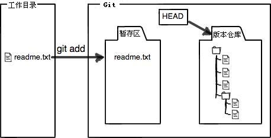

添加到暂存区后再次修改文件的内容：

    [root@serverA ServerA]# echo "This is an test page2" > test.page

将暂存区的文件提交到Git版本仓库，命令格式为"git commit -m "提交说明"

    [root@serverA ServerA]# git commit -m "This is test commit"
    [master (root-commit) f810c8a] This is test commit
     1 file changed, 1 insertion(+)
     create mode 100644 test.page

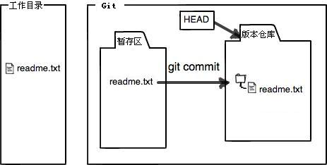
查看当前工作目录的状态
\[root\@serverA ServerA]# git status
On branch master
Changes not staged for commit:
(use "git add \<file>..." to update what will be committed)
(use "git restore \<file>..." to discard changes in working directory)
modified:   test.page
modified test.page 修改
因为提交操作只是将文件在暂存区中的快照版本提交到Git版本数据库，所以当你将文件添加到暂存区后，如果又对文件做了修改，请一定要再将文件添加到暂存区后提交到Git版本数据库：

    第一次修改 -> git add -> 第二次修改 -> git add -> git commit

演示示例
3.1 查看当前工作目录状态，	modified:   test.page （已修改，未增加到缓存区）
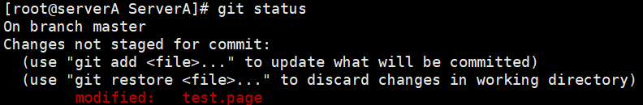

    [root@serverA ServerA]# git status
    On branch master
    Changes not staged for commit:
      (use "git add <file>..." to update what will be committed)
      (use "git restore <file>..." to discard changes in working directory)
    	modified:   test.page

3.2 将文件提交到缓存区(modified变成绿色)
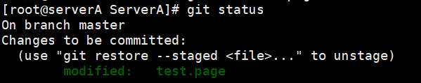
3.3 将缓存区中文件的快照提交到git数据库
\[root\@serverA ServerA]# git commit -m "第二次修改" test.page
3.4 再次查看工作目录状态

查看当前文件内容与Git版本数据库的区别:
语法 git diff 文件名
\[root\@serverA ServerA]# git diff test.page
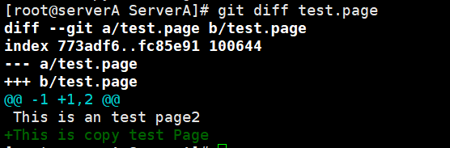
现在在把文件提交到正式git数据库

    [root@serverA ServerA]# git add test.page 
    [root@serverA ServerA]# git commit "This is a test3 page" test.page 
    error: pathspec 'This is a test3 page' did not match any file(s) known to git
    [root@serverA ServerA]# git commit -m "This is a test3 page" test.page 
    [master 0a915d2] This is a test3 page
     1 file changed, 1 insertion(+)

再次查看git版本仓库的状态

    [root@serverA ServerA]# git status
    On branch master
    nothing to commit, working tree clean

##### 文件组合提交

有些时候工作目录内的文件会比较多，懒的把文件一个个提交到暂存区，可以先设置下要忽略上传的文件（写入到"工作目录/.gitignore"文件中），然后使用"git add ."命令来将当前工作目录内的所有文件都一起添加到暂存区域。

    //忽略所有以.a为后缀的文件。
    *.a
    //但是lib.a这个文件除外，依然会被提交。
    !lib.a
    //忽略build目录内的所有文件。
    build/
    //忽略build目录内以txt为后缀的文件。
    build/*.txt
    //指定忽略名字为git.c的文件。
    git.c

环境实例:
在工作目录中创建一个名字为git.c的文件:

    # 创建测试测试文件
    [root@serverA ServerA]# touch git.c
    然后创建忽略文件列表
    [root@serverA ServerA]# echo "git.c" >> .gitignore
    将本次更改后的文件全部提交
    [root@serverA ServerA]# git add .
    # 将缓存区的文件提交到git数据库
    [root@serverA ServerA]# git commit -m "This is a gitignore test"
    [master ef40ca3] This is a gitignore test
     1 files changed, 1 insertion(+)
     create mode 100644 .gitignore

##### 跳过缓存区，直接上传到git仓库

语法\:git commit -a -m "备注"

    [root@serverA ServerA]# git commit -a -m "This is Modified again"
    [root@serverA ServerA]# sed -i '1s/That/This/g' test.page
    [root@serverA ServerA]# git commit -a -m "This is Modified again" 
    [master 1284714] This is Modified again
     1 file changed, 1 insertion(+), 1 deletion(-)
    [root@serverA ServerA]# git status
    On branch master
    nothing to commit, working tree clean

强制提交忽略文件
\[root\@serverA ServerA]# git add -f git.c
将缓存区的文件保存到服务
\[root\@serverA ServerA]# git commit  --amend
\[master 183e02c] This is Modified again
Date: Tue Jan 3 16:50:16 2023 +0800
1 file changed, 1 insertion(+), 1 deletion(-)
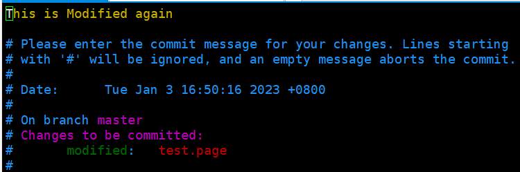
##### 提交时常见问题
Q：输入git add readme.txt，得到错误：fatal: not a git repository (or any of the parent directories)。

A：Git命令必须在Git仓库目录内执行（git init除外），在仓库目录外执行是没有意义的。

Q：输入git add readme.txt，得到错误fatal: pathspec 'readme.txt' did not match any files。

A：添加某个文件时，该文件必须在当前目录下存在，用ls或者dir命令查看当前目录的文件，看看文件是否存在，或者是否写错了文件名。

### 移除数据

有些时候会想把已经添加到暂存区的文件移除，但仍然希望文件在工作目录中不丢失，换句话说，就是把文件从追踪清单中删除。
先添加一个新文件，并上传到暂存区：
语法：

```
git rm [选项] 参数（文件名）删除Git仓库的文件
--cached Git暂存区域的追踪列表中移除（并不会删除当前工作目录内的数据文件）
-r Git暂存区域的追踪列表与当前工作目录中删除

```

实例

*   创建并提交测试文件
    \[root\@serverA ServerA]# touch databases
    \[root\@serverA ServerA]# git add databases
*   查看当前git状态
    \[root\@serverA ServerA]# git status
    On branch master
    Changes to be committed:
    (use "git restore --staged \<file>..." to unstage)
    new file:   databases
*   将该文件从Git暂存区域的追踪列表中删除（并不会删除当前工作目录上的数据文件）


    #将databases文件从Git暂存区局的追踪列表
    [root@serverA ServerA]# git rm --cached databases 
    rm 'databases'
    [root@serverA ServerA]# ls
    copy.txt  databases  git.c  test.page  test.txt

*   再次查看本次Git状态（此时文件已经是未追踪状态了Untracked files）
    \[root\@serverA ServerA]# git status
    On branch master
    Untracked files:
    (use "git add \<file>..." to include in what will be committed)
    databases
    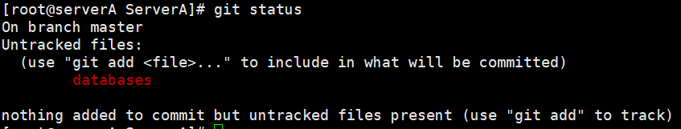

##### 删除Git缓存区和工作目录下的文件

\#将文件提交到缓存区
\[root\@serverA ServerA]# git add .
\#使用git rm命令可以直接删除暂存区内的追踪信息及工作目录内的数据文件：
但如果在删除之前数据文件已经被放入到暂存区域的话，Git会担心你勿删未提交的文件而提示报错信息，此时可追加强制删除-f参数。
\[root\@serverA ServerA]# git rm -f databases
rm 'databases'
数据文件已删除
\[root\@serverA ServerA]# ls
copy.txt  git.c  test.page  test.txt
\#查看git状态
\[root\@serverA ServerA]# git status
On branch master
Changes to be committed:
(use "git restore --staged \<file>..." to unstage)
new file:   databases

#### 移动数据

Git不像其他版本控制系统那样跟踪文件的移动操作，如果要修改文件名称，则需要使用git mv命令：

*   改名操作1（先更改Git库中的文件名称，再次提交后将改变源文件名称）
    查看当前的用户状态
    \[root\@serverA ServerA]# git status
    On branch master
    nothing to commit, working tree clean
    通过git mv命令进行改名操作
    \[root\@serverA ServerA]# ls
    copy.txt  git.c  test.page  test.txt
    \[root\@serverA ServerA]# git mv test.page testpage.page
    再次查看git目录状态与文件名称
    \[root\@serverA ServerA]# git status
    On branch master
    Changes to be committed:
    (use "git restore --staged &lt;file&gt;..." to unstage)
    renamed:    test.page -> testpage.page
    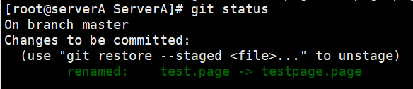
    将文件提交到Git数据库，再次查看目录下的工作名称
    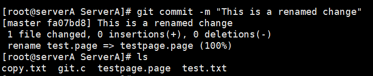
    \#原文件名称一起改变
*   改名操作2（先将工作目录下的数据文件改变名称，在删除原有Git版本仓库内的文件快照:）

    *   将工作目录中的数据文件改名


        [root@serverA ServerA]# ls
        copy.txt  git.c  testpage.page  test.txt
        [root@serverA ServerA]# mv test.txt test2.txt

    *   删除Git版本仓库中的文件快照


        [root@serverA ServerA]# git rm test.txt 
        rm 'test.txt'

    *   将改名后的新文件添加


        [root@serverA ServerA]# git commit -a -m "This is file rename change"
        [master 62c32b8] This is file rename change
         1 file changed, 1 deletion(-)
         delete mode 100644 test.txt

#### 查看文件的历史记录

在完成上面的实验后，我们已经不知不觉有了很多次的提交操作了，可以用git ==log命令来查看提交历史记录：==
语法: git log \[选项] \[参数] (文件名称)

    [root@serverA ServerA]# git log testpage.page
    commit fa07bd88eb8d3fa9657e56832d8d05d3ed1c2de6
    Author: Liu Shan Xin <L1797261354@163.com>
    Date:   Wed Jan 4 10:13:20 2023 +0800

        This is a renamed change
    [root@serverA ServerA]# git log
    commit 62c32b8544a022a44116900cee5686807cc347c8 (HEAD -> master)
    Author: Liu Shan Xin <L1797261354@163.com>
    Date:   Wed Jan 4 10:31:07 2023 +0800

        This is file rename change

    commit fa07bd88eb8d3fa9657e56832d8d05d3ed1c2de6
    Author: Liu Shan Xin <L1797261354@163.com>
    Date:   Wed Jan 4 10:13:20 2023 +0800

        This is a renamed change

==查看最近文件的提交记录==

    像上面直接执行git log命令后会看到所有的更新记录（按时间排序，最近更新的会在上面），历史记录会除了保存文件快照，还会详细的记录着文件SHA-1校验和，作者的姓名，邮箱及更新时间，如果只想看最近几条记录，可以直接这样操作：git log -次数(number)
    [root@serverA ServerA]# git log -2
    commit 62c32b8544a022a44116900cee5686807cc347c8 (HEAD -> master)
    Author: Liu Shan Xin <L1797261354@163.com>
    Date:   Wed Jan 4 10:31:07 2023 +0800

        This is file rename change

    commit fa07bd88eb8d3fa9657e56832d8d05d3ed1c2de6
    Author: Liu Shan Xin <L1797261354@163.com>
    Date:   Wed Jan 4 10:13:20 2023 +0800

        This is a renamed change

==查看每次提交内容的差异==

    git log -p -1
    [root@serverA ServerA]# git log -p -1 testpage.page
    commit fa07bd88eb8d3fa9657e56832d8d05d3ed1c2de6
    Author: Liu Shan Xin <L1797261354@163.com>
    Date:   Wed Jan 4 10:13:20 2023 +0800

        This is a renamed change

    diff --git a/testpage.page b/testpage.page
    new file mode 100644
    index 0000000..a7ab641
    --- /dev/null
    +++ b/testpage.page
    @@ -0,0 +1,2 @@
    +This is an test page2
    +That is copy test Page

\--查看文件的显示数据增改行数--
我们还可以使用--stat参数来简要的显示数据增改行数，这样就能够看到提交中修改过的内容、对文件添加或移除的行数，并在最后列出所有增减行的概要信息（仅看最近两次的提交历史):
语法\:git log --stat -2 文件名

    [root@serverA ServerA]# git log --stat -1 testpage.page
    commit 6383fff306735b71bb4516047ce5ac04ec483410 (HEAD -> master)
    Author: Liu Shan Xin <L1797261354@163.com>
    Date:   Thu Jan 12 15:24:09 2023 +0800

        Your agins

     testpage.page | 1 +
     1 file changed, 1 insertion(+)

==查看文件提交的历史信息==
还有一个超级常用的--pretty参数，它可以根据不同的格式为我们展示提交的历史信息，比如每行显示一条提交记录。
语法\:git log --pretty=oneline 文件名

    [root@serverA ServerA]# git log --pretty=oneline testpage.page
    6383fff306735b71bb4516047ce5ac04ec483410 (HEAD -> master) Your agins
    fa07bd88eb8d3fa9657e56832d8d05d3ed1c2de6 This is a renamed change

==详细模式输出最近几次的历史记录==
git log --pretty=fuller -2(number) 文件名

    [root@serverA ServerA]# git log --pretty=fuller -2 testpage.page
    commit 6383fff306735b71bb4516047ce5ac04ec483410 (HEAD -> master)
    Author:     Liu Shan Xin <L1797261354@163.com>
    AuthorDate: Thu Jan 12 15:24:09 2023 +0800
    Commit:     Liu Shan Xin <L1797261354@163.com>
    CommitDate: Thu Jan 12 15:24:09 2023 +0800

        Your agins

    commit fa07bd88eb8d3fa9657e56832d8d05d3ed1c2de6
    Author:     Liu Shan Xin <L1797261354@163.com>
    AuthorDate: Wed Jan 4 10:13:20 2023 +0800
    Commit:     Liu Shan Xin <L1797261354@163.com>
    CommitDate: Wed Jan 4 10:13:20 2023 +0800

        This is a renamed change

还可以使用format参数来指定具体的输出格式，这样非常便于后期编程的提取分析哦，常用的格式有：

| 参数  | 说明                |
| --- | ----------------- |
|     |                   |
| %s  | 提交说明。             |
| %cd | 提交日期。             |
| %an | 作者的名字             |
| %cn | 提交者的姓名。           |
| %ce | 提交者的电子邮件。         |
| %H  | 提交对象的完整SHA-1哈希字串。 |
| %h  | 提交对象的简短SHA-1哈希字串。 |
| %T  | 树对象的完整SHA-1哈希字串。  |
| %t  | 树对象的简短SHA-1哈希字串。  |
| %P  | 父对象的完整SHA-1哈希字串。  |
| %p  | 父对象的简短SHA-1哈希字串。  |
| %ad | 作者的修订时间。          |

另外作者和提交者是不同的，作者才是对文件作出实际修改的人，而提交者只是最后将此文件提交到Git版本数据库的人。
范例：

    [root@serverA ServerA]# git log --pretty=format:"%s %cd %cn" testpage.page
    Your agins Thu Jan 12 15:24:09 2023 +0800 Liu Shan Xin
    This is a renamed change Wed Jan 4 10:13:20 2023 +0800 Liu Shan Xin

#### 还原数据

还原数据是每一个版本控制的基本功能，先来随意修改下文件吧：

    [root@serverA ServerA]# echo "第三次测试" >>test
    test2.txt      testpage.page  
    [root@serverA ServerA]# echo "第三次测试" >>testpage.page 

将文件提交到Git版本仓库:

    [root@serverA ServerA]# git add testpage.page 
    [root@serverA ServerA]# git commit -m "这是第三次提交" 
    [master b5c1a6f] 这是第三次提交
     1 file changed, 1 insertion(+)

##### 还原数据

此时觉得写的不好，提交错了，想要还原某次提交的文件快照:
\-1 查看提交记录

    [root@serverA ServerA]# git log --pretty=oneline testpage.page
    b5c1a6f8a87575ab3ef341682d112349405fa2d8 (HEAD -> master) 这是第三次提交
    6383fff306735b71bb4516047ce5ac04ec483410 Your agins
    fa07bd88eb8d3fa9657e56832d8d05d3ed1c2de6 This is a renamed change

Git服务程序中有一个叫做HEAD的版本指针，当用户申请还原数据时，其实就是将HEAD指针指向到某个特定的提交版本而已，但是因为Git是分布式版本控制系统，所以不可能像SVN那样使用1、2、3、4来定义每个历史的提交版本号，为了避免历史记录冲突，故使用了SHA-1计算出十六进制的哈希字串来区分每个提交版本，像刚刚最上面最新的提交版本号就是5cee15b32d78259985bac4e0cbb0cdad72ab68ad，另外默认的HEAD版本指针会指向到最近的一次提交版本记录哦，而上一个提交版本会叫HE^，上上一个版本则会叫做HEAD^^，当然一般会用HE~5来表示往上数第五个提交版本哦~。
==还原记录==
我们已经锁定了要还原的历史提交版本，就可以使用git reset命令来还原数据了：

*   锁定要还原的版本
*   通过git reset 命令还原版本


    [root@serverA ServerA]# git reset --hard HEAD^
    HEAD is now at 6383fff Your agins
    还原上次提交的文件
    [root@serverA ServerA]# ls
    copy.txt  git.c  test2.txt  testpage.page
    [root@serverA ServerA]# cat testpage.page 
    This is an test page2
    what is a newpage
    That is copy test Page
    #已经还原到上次版本了

刚刚的操作实际上就是改变了HEAD版本指针的位置，说白了就是你将HEAD指针放在哪里，那么你当前的工作版本变回定位在哪里，要想把内容再还原到最新提交的版本，先查看下提交版本号吧：。

    [root@serverA ServerA]# git log --pretty=oneline
    6383fff306735b71bb4516047ce5ac04ec483410 Your agins
    62c32b8544a022a44116900cee5686807cc347c8 This is file rename change
    fa07bd88eb8d3fa9657e56832d8d05d3ed1c2de6 This is a renamed change
    183e02ca9a96bf1c27b35a470ca79638feb249ef This is Modified again

会发现没有第三次提交版本记录，原因很简单，因为我们当前的工作版本是历史的提交点
这个历史提交点还没有发生过==第三次提交==更新记录，所以当然就看不到了，要是想“还原到未来”的历史更新点，可以用git reflog命令来查看所有的历史记录：
==git reflog 查看提交版本号==
语法\:git reflog (文件名)

    [root@serverA ServerA]# git reflog -n 3
    1bd7b34 (HEAD -> master) HEAD@{0}: commit: 这是最新此提交
    6383fff HEAD@{1}: reset: moving to HEAD^
    b5c1a6f HEAD@{2}: commit: 这是第三次提交

找到历史还原点的SHA-1值后，就可以还原文件了，另外SHA-1值没有必要写全，Git会自动去匹配：x
==b5c1a6f== HEAD@{2}: commit: 这是第三次提交
==利用头部信息还原==

    [root@serverA ServerA]# git reset --hard b5c1a6f
    HEAD is now at b5c1a6f 这是第三次提交

==只是还原单个文件(git checkout)==
如是只是想把某个文件内容还原，就不必这么麻烦，直接用git checkout命令就可以的，先随便写入一段话：

    [root@serverA ServerA]# sed -i "1a 这是用git checkout还原" testpage.page 
    [root@serverA ServerA]# cat testpage.page 
    This is an test page2
    这是用git checkout还原

我们发现一开始不用写这句话，可以手工删除（当数据大规模时),还可以将文件内容从暂存区中恢复：

    [root@serverA ServerA]# git checkout testpage.page  
    Updated 1 path from the index
    [root@serverA ServerA]# cat testpage.page 
    This is an test page2
    what is a newpage
    That is copy test Page
    第三次测试

checkou规则是如果暂存区中有该文件，则直接从暂存区恢复，如果暂存区没有该文件，则将还原成最近一次文件提交时的快照。

#### 管理标签

当版本仓库内的数据有个大的改善或者功能更新，我们经常会打一个类似于软件版本号的标签，这样通过标签就可以将版本库中的某个历史版本给记录下来，方便我们随时将特定历史时期的数据取出来用，另外打标签其实只是向某个历史版本做了一个指针，所以一般都是瞬间完成的，感觉很方便吧。
在Git中打标签非常简单，给最近一次提交的记录打个标签：
==对象:软件仓库==

##### ==创建标签==

版本\:git tag 版本号

    [root@serverA ServerA]# git tag v1.0
    [root@serverA ServerA]# echo "仓库版本"  >> regist.txt

##### 查看已有标签

==查看已有标签\:git tag==

    [root@serverA ServerA]# git tag
    v1.0

==查看此标签的详细信息==

    [root@serverA ServerA]# git show v1.0 
    commit b5c1a6f8a87575ab3ef341682d112349405fa2d8 (HEAD -> master, tag: v1.0)
    Author: Liu Shan Xin <L1797261354@163.com>
    Date:   Thu Jan 12 16:27:10 2023 +0800

        这是第三次提交

    diff --git a/testpage.page b/testpage.page
    index a2389ba..042c394 100644
    --- a/testpage.page
    +++ b/testpage.page
    @@ -1,3 +1,4 @@
     This is an test page2
     what is a newpage
     That is copy test Page
    +第三次测试

==创建带有说明的标签,用-a指定标签名，-m指定说明文字==

    [root@serverA ServerA]# git tag -a v1.1 -m "Version 1.1"
    [root@serverA ServerA]# git tag 
    v1.0
    v1.1

==删除带有说明的标签==
查看标签

    [root@serverA ServerA]# git tag 
    show
    v1.0
    v1.1

删除标签

    [root@serverA ServerA]# git tag -d v1.0
    Deleted tag 'v1.0' (was b5c1a6f)

#### 管理分支结构

分支即是平行空间，假设你在为某个手机系统研发拍照功能，代码已经完成了80%，但如果将这不完整的代码直接提交到git仓库中，又有可能影响到其他人的工作，此时我们便可以在该软件的项目之上创建一个名叫“拍照功能”的分支，这种分支只会属于你自己，而其他人看不到，等代码编写完成后再与原来的项目主分支合并下即可，这样即能保证代码不丢失，又不影响其他人的工作。
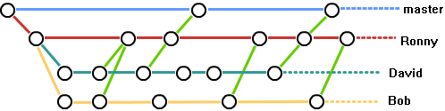
一般在实际的项目开发中，我们要尽量保证master分支是非常稳定的，仅用于发布新版本，平时不要随便直接修改里面的数据文件，而工作的时候则可以新建不同的工作分支，等到工作完成后在合并到master分支上面，所以团队的合作分支看起来会像上面图那样。
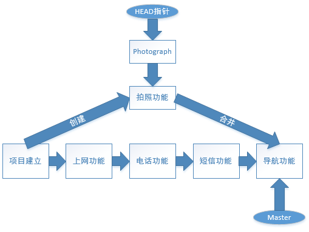
另外如前面所讲，git会将每次的提交操作串成一个时间线，而在前面的实验中实际都是在对master分支进行操作，Git会在创建分支后默认创建一个叫做Photograph的指针，所以我们还需要再将HEAD指针切换到“Photograph”的位置才正式使用上了新分支哦，这么说起来可能比较抽象，赶紧学习下面的实验吧。
==创建分支==
格式\:git branch 分支名称

    [root@serverA ServerA]# git branch 测试分支

切换至所属分支:
格式\:git checkout 分支名称

    [root@serverA ServerA]# git checkout 测试分支 
    Switched to branch '测试分支'

查看当前的分支情况
格式\:git brance

    [root@serverA ServerA]# git branch 
      master
    * 测试分支
    [root@serverA ServerA]# ls
    copy.txt  git.c  regist.txt  test2.txt  testpage.page

我们对文件进行追加一行字符串,并提交字符串

    [root@serverA ServerA]# echo "这是条测试分支内容" >> testpage.page 
    [root@serverA ServerA]# git add testpage.page 
    [root@serverA ServerA]# git commit -m "这是一次分支提交" testpage.page 
    [测试分支 f946f95] 这是一次分支提交
     1 file changed, 1 insertion(+)

==切换源分支并查看文件内容==

    [root@serverA ServerA]# git branch 
      master
    * 测试分支
    [root@serverA ServerA]# git checkout master 
    Switched to branch 'master'
    [root@serverA ServerA]# cat testpage.page 
    This is an test page2
    what is a newpage
    That is copy test Page
    第三次测试

#### 合并分支

现在，我们想把测试分支的工作成果合并到master分支上了，则可以使用"git merge"命令来将指定的的分支与当前分支合并：
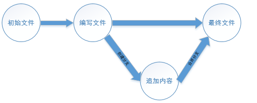
在本地master分支下，合并测试分支
语法：git merge \[合并的分支名称]

    [root@serverA ServerA]# git branch 
    * master
      测试分支
    [root@serverA ServerA]# git merge 测试分支
    Updating b5c1a6f..f946f95
    Fast-forward
     testpage.page | 1 +
     1 file changed, 1 insertion(+)

查看合并的文件内容

    [root@serverA ServerA]# cat testpage.page 
    This is an test page2
    what is a newpage
    That is copy test Page
    第三次测试
    这是条测试分支内容
    #与第一次相比较，增加合并后的内容

==删除分支==
格式： git branch -d "分支名称"

    [root@serverA ServerA]# git branch -d "测试分支"
    Deleted branch 测试分支 (was f946f95).

##### 内容冲突

但是Git并不能每次都为我们自动的合并分支，当遇到了内容冲突比较复杂的情况，则必须手工将差异内容处理掉，比如这样的情况：
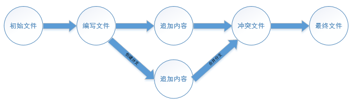
创建新的分支提交

    #创建新的分支并切换到新分支
    [root@serverA ServerA]# git checkout -b 第二次冲突
    Switched to a new branch '第二次冲突'
    #增加第二次提交内容
    [root@serverA ServerA]# echo "增加冲突内容" >> testpage.page 
    #提交到数据库
    [root@serverA ServerA]# git add testpage.page 
    [root@serverA ServerA]# git commit -m "这是测试冲突的提交"
    [第二次冲突 8be9682] 这是测试冲突的提交
     1 file changed, 1 insertion(+)
    [root@serverA ServerA]# git branch 
      master
    * 第二次冲突

==切换到master分支==

    [root@serverA ServerA]# git checkout master 
    Switched to branch 'master'

创建冲突的文件内容并进行提交

    [root@serverA ServerA]# echo "这是master分支上的提交" >> testpage.page
    [root@serverA ServerA]# git add testpage.page 
    [root@serverA ServerA]# git commit -m "在master上的提交" testpage.page
    [master 00e2c48] 在master上的提交
     1 file changed, 1 insertion(+)

经过提交，mast分支与"第二次冲突"分支各自都分别有新的提交，变成这样了：
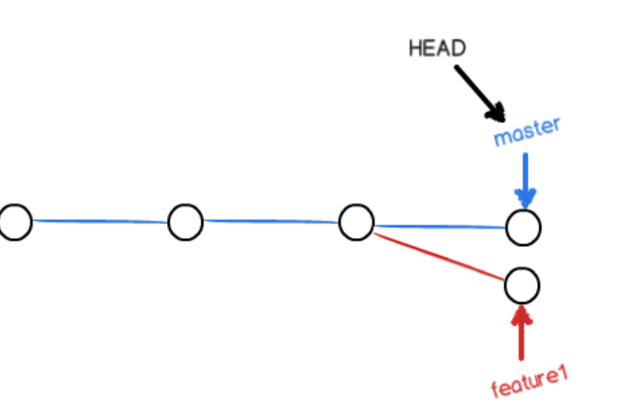
这种情况下，Git无法执行“快速合并”，只能试图把各自的修改合并起来，但这种合并就可能会有冲突,果然Git文件存在冲突，必须手动解决冲突后再提交,git status也可以告诉我们冲突的文件：
```
On branch master
You have unmerged paths.
  (fix conflicts and run "git commit")
  (use "git merge --abort" to abort the merge)

Unmerged paths:
  (use "git add <file>..." to mark resolution)
	both modified:   testpage.page
```

==解决冲突==
查看冲突内容
```
[root@serverA ServerA]# cat testpage.page 
This is an test page2
what is a newpage
That is copy test Page
第三次测试
这是条测试分支内容
\<<<<<<< HEAD
这是master分支上的提交
=======
增加冲突内容
\>>>>>>> 第二次冲突
```
第一部分是当前版本mast分支上的版本，第二部分是“第二次冲突”上的版本
Git用<<<<<<<，=======，>>>>>>
标记出不同分支的内容，我们修改如下后保存，并提交：
```
[root@serverA ServerA]# cat testpage.page 
This is an test page2
what is a newpage
That is copy test Page
第三次测试
这是条测试分支内容
这是master分支上的提交
增加冲突内容
[root@serverA ServerA]# git commit -m "这是第二次提交"
[master ee95ebc] 这是第二次提交
```
查看Git历史提交记录(可以看到分支的变化)：
```
[root@serverA ServerA]# git log --graph --pretty=oneline --abbrev-commit
*   ee95ebc (HEAD -> master) 这是第二次提交
|\  
| * 8be9682 (第二次冲突) 这是测试冲突的提交
* | 00e2c48 在master上的提交
|/  
* f946f95 这是一次分支提交
```
最后删除分支
```
[root@serverA ServerA]# git branch
* master
  第二次冲突
[root@serverA ServerA]# git branch -d 第二次冲突
Deleted branch 第二次冲突 (was 8be9682).
```
小结
```
当Git无法自动合并分支时，就必须首先解决冲突。解决冲突后，再提交，合并完成。

解决冲突就是把Git合并失败的文件手动编辑为我们希望的内容，再提交。
```
#### 拉取代码（仓库同步）
同步，也可以称之为拉取，在Git中是非常频繁的操作，和SVN不同，Git的所有仓库之间是平等的，所以，为了保证代码一致性，尽可能的在每次操作前进行一次同步操作，具体的为在工作目录下执行如下命令:
```
git pull origin master
```
其中origin代表的是你远程的仓库，可以通过命令 git remote -v 查看，master是分支名，如果你本地是其他分支，请换成其他分支的名字，另，因为远程仓库与你本地仓库可能存在冲突，故当存在冲突时，请参考进阶篇的如何处理冲突
#### 代码推送
和拉取一样，也是一个非常频繁的操作，当你代码有更新时，你需要更新到远程仓库，这个动作被称之为推送，执行的命令与拉取一样，只是将其中的pull这个单词改成push，同样，如果远程仓库存在你本地仓库没有的更新，则在推送前你需要先进行一次同步，如果你确定你不需要远程的更新，则在推送时加上 -f 选项，则可以强制推送，注:在协同开发中，我并不建议这么做，因为这样很可能覆盖别人的代码。
格式 git push 远程仓库名称 远程仓库分支名称
推送代码实例：
```
git push origin master
```
### Git 本地钩子
Git 钩子（Git Hooks）是 Git 版本控制系统中的一种机制，允许在特定事件（如提交、推送、合并等）发生时自动触发自定义脚本，用于自动化工作流程或执行检查。
Git 钩子最常见的使用场景包括推行提交规范，根据仓库状态改变项目环境，和接入持续集成工作流。但是，因为脚本可以完全定制，你可以用 Git 钩子来自动化或者优化你开发工作流中任意部分。
#### 核心概念：
- 位置​：
钩子脚本存储在 Git 仓库的 .git/hooks/目录中，默认包含示例脚本（以 .sample结尾）。
触发时机​:分为客户端钩子（本地事件）和服务端钩子（远程仓库事件）：
#### - 客户端钩子:
本地钩子只影响它们所在的仓库。当你在读这一节的时候，记住开发者可以修改他们本地的钩子，所以不要用它们来推行强制的提交规范。不过，它们确实可以让开发者更易于接受这些规范
例如 pre-commit（提交前）、post-merge（合并后）。
- pre-commit
- prepare-commit-msg
- commit-msg
- post-commit
- post-checkout
- pre-rebase
- update 
前四个钩子让你介入完整的提交生命周期，后两个允许你执行一些额外的操作,，分别为 git checkout 和 git rebase 的安全检查。
所有带pre- 的钩子允许你修改即将发生的操作，而带post- 的钩子只能用于通知。
#### 服务端钩子：
例如 pre-receive（推送前校验代码）、update()、post-receive(提交后进行信息推送)。
```
这些钩子都允许你对 git push 的不同阶段做出响应。
服务端钩子的输出会传送到客户端的控制台中，所以给开发者发送信息是很容易的。但你要记住这些脚本在结束完之前都不会返回控制台的控制权，所以你要小心那些长时间运行的操作。
```
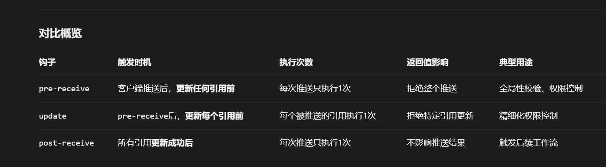
##### pre-receive钩子
pre-receive钩子在有人用 git push向仓库推送代码时被执行。它只存在于远端仓库中，而不是原来的仓库中。引用路径为如下:
```
接收标准输入，格式：<旧SHA> <新SHA> <引用路径>
```
#### 创建git钩子示例与用途
| 钩子名称 | 触发时机 | 典型用途|
| --- | --- | --- |
| pre-commit | 执行 git commit前 | 检查代码风格、运行测试 |
| commit-msg | 提交消息保存前 | 校验提交信息的格式 |
| post-checkout | 切换分支后 | 自动安装依赖或更新配置 |
| pre-push | 执行 git push前 | 推送前运行完整测试套件 |
| pre-receive | 服务端接收推送前 | 验证提交的权限或内容 |
|
#### 钩子的脚本语言
内置的脚本大多是 shell和 PERL 语言的，但你可以使用任何脚本语言，只要它们最后能编译到可执行文件。每次脚本中的 #!/bin/sh 定义了你的文件将被如何解释。比如，使用其他语言时你只需要将 path 改为你的解释器的路径即可。
#### 钩子的作用域
对于任何 Git 仓库来说钩子都是本地的，而且它不会随着 git clone 一起复制到新的仓库。而且，因为钩子是本地的，任何能接触得到仓库的人都可以修改。
在开发团队中维护钩子是比较复杂的，因为 .git/hooks 目录不随你的项目一起拷贝，也不受版本控制影响。一个简单的解决办法是把你的钩子存在项目的实际目录中（在 .git 外）。这样你就可以像其他文件一样进行版本控制。为了安装钩子，你可以在 .git/hooks 中创建一个符号链接，或者简单地在更新后把它们复制到 .git/hooks 目录下。


