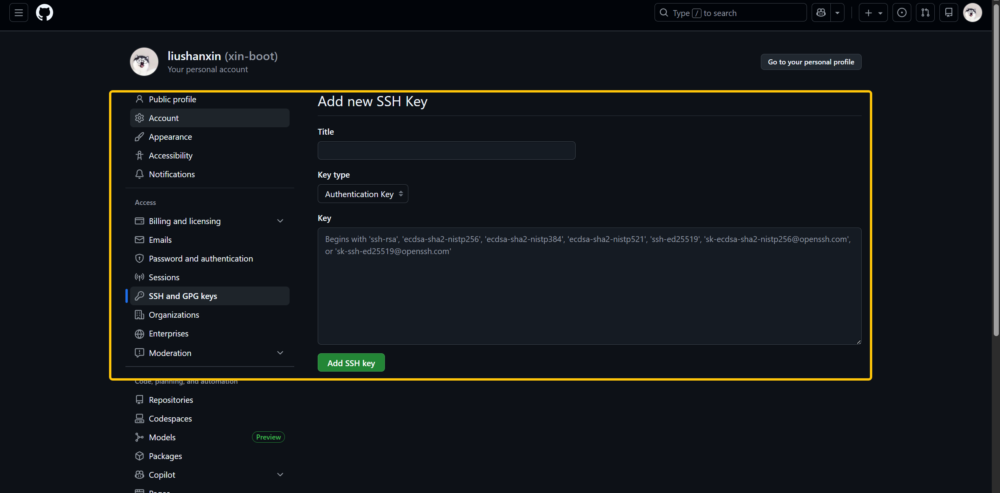
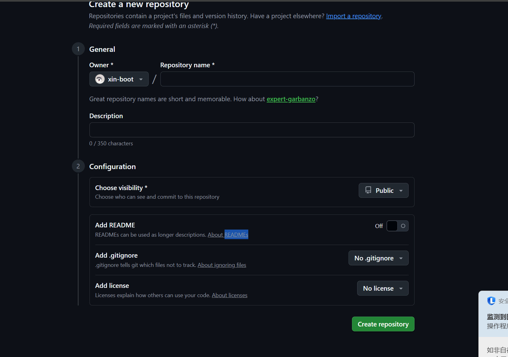

# Github与服务端裸仓库仓库进行联动
- 目标：开发端将数据推送到服务器的裸仓库，裸仓库将数据发送到github的远程仓库
### 在github创建空仓库与关联ssh密钥文件
####  git用户创建秘钥文件
- ==注意要用git用户==
```
[git@develloper operation-engineer.git]$ ssh-keygen -t ed25519 -C "xin1797261354@gmail.com"
Generating public/private ed25519 key pair.
Enter file in which to save the key (/home/git/.ssh/id_ed25519): 
Enter passphrase for "/home/git/.ssh/id_ed25519" (empty for no passphrase): 
Enter same passphrase again: 
Your identification has been saved in /home/git/.ssh/id_ed25519
Your public key has been saved in /home/git/.ssh/id_ed25519.pub
The key fingerprint is:
SHA256:cOHq68s7dnh1SlC2J+ybmWF/GVgtqxJ8n9eOcwAXt04 xin1797261354@gmail.com
The key's randomart image is:
+--[ED25519 256]--+
|        .        |
|       . .o   . .|
|      . o+ .   +.|
|       +. + o +E.|
|      . S+ o =oo |
|     .    O + +. |
|      .. + % o =.|
|     .+.o B o *.+|
|     o**   . ..=.|
+----[SHA256]-----+
[git@develloper operation-engineer.git]$ cat /home/git/.ssh/id_ed25519.pub 
*****
```
#### 在Github注册并添加本地服务器公钥信息

```
在服务端测试ssh是否正确
[root@serverA Registry]# ssh -T git@github.com 
Hi xin-boot! You've successfully authenticated, but GitHub does not provide shell access.
#看到successfully，便表明通信成功
```
#### 在Github创建远程仓库

### 在服务器端创建裸仓库，并将裸仓库与远程仓库进行关联
```
#创建git仓库目录
[root@develloper operation-engineer.git]# ll /data/operation-engineer/operation-engineer.git
#创建裸仓库
[root@develloper operation-engineer.git]# git init --bare operation-engineer.git
#配置git仓库的用户名
[root@develloper operation-engineer.git]# git config --global user.name "liusx"
#配置git仓库的邮箱
[root@develloper operation-engineer.git]# git config --global user.email "xin1797261354@gmail.com"
#配置git仓库的远程地址
[root@develloper operation-engineer.git]# git remote add origin git@github.com:xin-boot/operation-engineer.git
#检查远程配置
git remote -v
#配置远程仓库的权限
[root@develloper operation-engineer.git]# chmod -R git:git /data/operation-engineer/operation-engineer.git 
```
#### 开发机器
通过ssh协议将数据从git仓库拉去到本地PC
```
git clone ssh://git@******/data/operation-engineer/operation-engineer.git
```
在本地添加文件后，进行提交推送，验证是否功能正常
#### 服务端添加钩子，实现数据自动推送git仓库后，自动推送到github远程仓库
- update钩子
```
#!/bin/bash
# 只做验证，不同步
refname="$1"

allowed_branches="^refs/heads/(master|main|develop|feature/.*)$"

if [[ ! $refname =~ $allowed_branches ]]; then
    echo "❌ 不允许推送到分支: $refname"
    exit 1
fi

exit 0
```
- post-receive钩子
```
[git@develloper hooks]$ cat post-receive 
#!/bin/bash
# 在更新后同步
while read oldrev newrev refname
do
    branch_name=${refname#refs/heads/}
    
    echo "正在同步分支 '$branch_name' 到 GitHub..."
    if git push origin "$branch_name"; then
        echo "✅ 同步完成"
    else
        echo "⚠️ 同步失败，但本地更新已接受"
        # 不返回错误，因为本地更新已成功
    fi
done
```